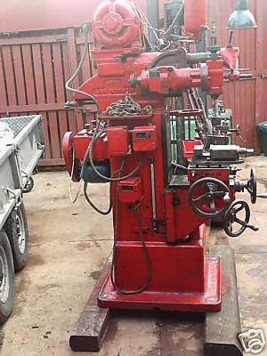

# Van Norman

Information surrounding the Van Norman milling machine that we bought off of eBay. A great tool
that could have done with a bed regrind. It didn't have much life left in it, but it was a beast.

There's some information about the [spindle taper](taper.md). I converted an MT3 (or 5C, can't quite remember
which) ER32 collet set to fit the spindle of the Van Norman.

Some Photos

